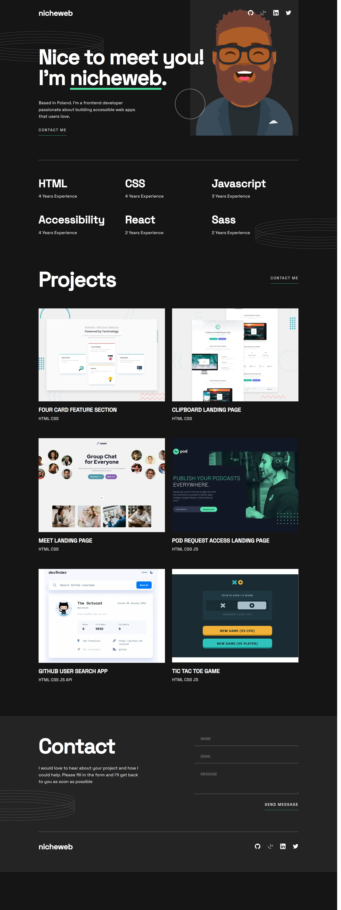

# Frontend Mentor - Single-page developer portfolio solution

This is a solution to the [Single-page developer portfolio challenge on Frontend Mentor](https://www.frontendmentor.io/challenges/singlepage-developer-portfolio-bBVj2ZPi-x). Frontend Mentor challenges help you improve your coding skills by building realistic projects.

## Table of contents

- [Overview](#overview)
  - [The challenge](#the-challenge)
  - [Screenshot](#screenshot)
  - [Links](#links)
- [My process](#my-process)
  - [Built with](#built-with)
  - [What I learned](#what-i-learned)
  - [Continued development](#continued-development)
  - [Useful resources](#useful-resources)
- [Author](#author)
- [Acknowledgments](#acknowledgments)

## Overview

### The challenge

Users should be able to:

- Receive an error message when the `form` is submitted if:
  - Any field is empty
  - The email address is not formatted correctly
- View the optimal layout for the interface depending on their device's screen size
- See hover and focus states for all interactive elements on the page
- **Bonus**: Hook the form up so it sends and stores the user's enquiry (you can use a spreadsheet or Airtable to save the enquiries)
- **Bonus**: Add your own details (image, skills, projects) to replace the ones in the design

### Screenshot

### Links

- Solution URL: [https://github.com/niche-web/spa-portfolio](https://github.com/niche-web/spa-portfolio)
- Live Site URL: [https://nicheweb-portfolio.netlify.app/](https://nicheweb-portfolio.netlify.app/)

## My process

### Built with

- Semantic HTML5 markup
- CSS custom properties
- Flexbox
- CSS Grid
- [React](https://reactjs.org/) - JS library
- Sass(BEM and 7-1 pattern)
- Vite

### What I learned

The biggest lesson I learned from this project was how important it is to establish a good structure that facilitates the development of the application by dividing it into small components, improving scalability and code readability for future maintenance and making the development of the application much easier.

### Continued development

For the future I would like to focus more in projects that has considerable state changes. Pushing myself to sharp my ReactJS skills

### Useful resources

Chatgpt

## Author

- Website - [Norge Rojas Cerulia](https://clever-cendol-c0a1da.netlify.app/)
- Frontend Mentor - [niche-web](https://www.frontendmentor.io/profile/niche-web)
- Twitter - [@Nani45670378](https://x.com/Nani45670378)

## Acknowledgments

I want to highlight a new tool that has emerged to help application developers and it is chatgpt. Chatgpt helped me a lot to deploy the backend that I used as a proxy to access Airtable. Obviously AI is more of an ally than an enemy.
